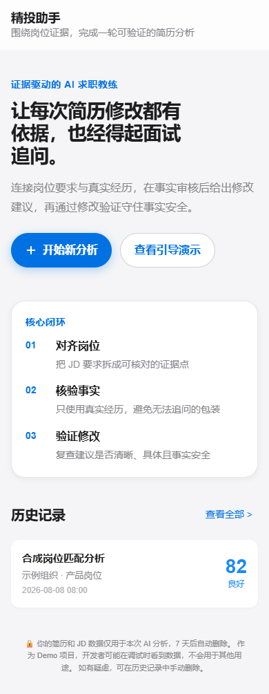
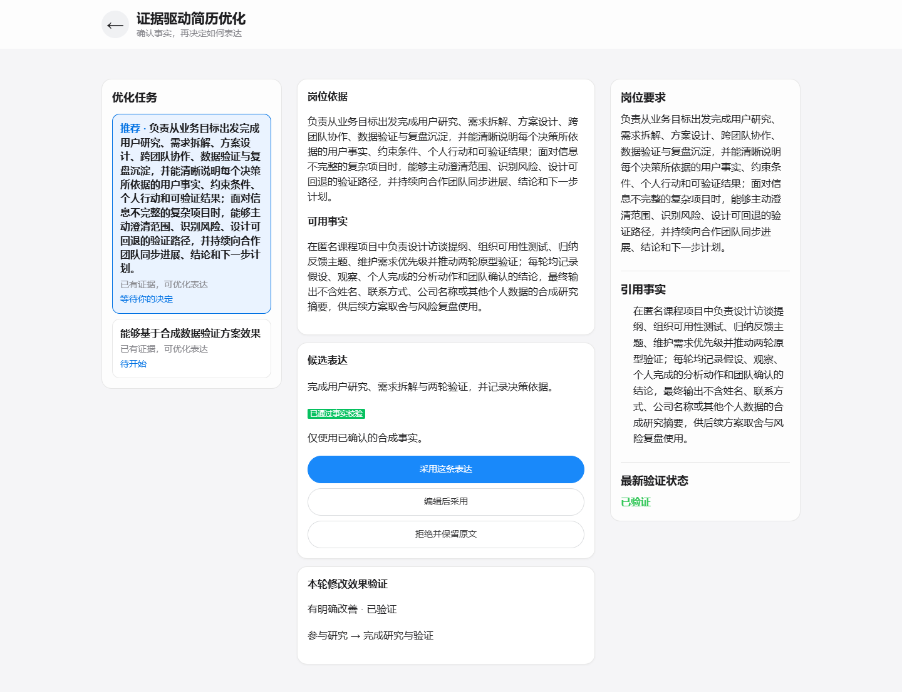
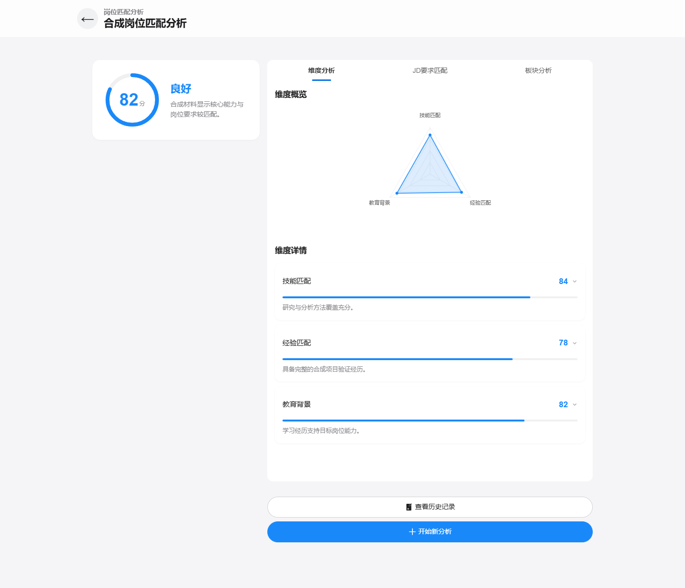

# 精投助手 (JobFit AI) — V0.1 求职作品版

> **证据驱动的 AI 简历教练**：让每次简历修改都有依据、也经得起面试追问。
> 不是帮你写简历，而是教你改简历——AI 只提建议，事实由你确认，最终由你决定。

**产品能力**：连接岗位要求、真实经历、事实审核与修改验证，把"AI 改简历"从不可信的黑盒变成可追溯、可审核、可停止的教练式闭环。

---

## 核心能力

| 能力 | 说明 |
|---|---|
| 🧭 证据驱动的优化 Agent | JD 要求 → 简历事实 → 充分度判断 → 动态追问 → 候选生成 → 强制事实审核 → 用户决定 |
| ✅ 事实确认 | AI 提取的每条事实必须由用户逐条确认，未确认事实不进入候选 |
| 🛡️ 双层事实安全 | 确定性规则 + 独立语义审核，拦截虚构数字、职责夸大、无依据主张 |
| 🔁 修改效果验证 | 每轮修改后计算 Diff、证据覆盖变化与安全状态，追加不可变记录 |
| 🎬 引导演示 `/demo` | 回放真实状态快照，无需实时 AI，30 秒看懂产品闭环 |
| 📊 6 维匹配分析 | 评分环 + 六维雷达图 + 需求逐项比对（保留） |
| 📱 多端响应式 | 手机 / 平板 / 电脑四档布局，Agent 工作台桌面双栏 + 证据上下文栏 |

### 双层事实安全（核心亮点）

大模型改简历会系统性夸大："参与"写成"主导"、"学习"写成"使用"、甚至凭空补数字。本产品用两层防线拦截：

1. **确定性规则**：数字红线（数值 + 单位 + 语义用途）、职责红线（参与/团队 → 主导/负责）、项目状态/证书/技能/学习经验扩大、事实引用有效性。
2. **独立语义审核**：候选与引用事实必须存在最低语义重叠，阻断"完全无关的自我介绍"混入。

审核异常、超时或格式非法一律降级为 `unavailable`，**绝不默认通过**。

---

## 用户旅程

```
首页 → JD 输入(粘贴/截图OCR) → 简历输入(粘贴/上传PDF·DOCX·TXT)
  → 补充经历(可选) → 证据匹配 → 选择优化任务 → 动态追问与事实确认
  → AI 候选(强制审核) → 采用/编辑/拒绝 → 修改效果验证 → 历史管理
```

**引导演示**：点击首页"查看引导演示"进入 `/demo`，按真实状态结构逐步回放完整闭环，不调用实时 AI。

---

## 技术栈

| 层 | 技术 |
|---|---|
| 前端 | Vue 3.5 (Composition API) + Vant 4 + Vite 8 |
| 后端 | Express 5 + Mongoose 9 |
| 数据库 | MongoDB |
| AI | DeepSeek API (`deepseek-chat`) |
| OCR / 文件解析 | Tesseract.js (中文+英文) / pdf-parse v2, mammoth |
| 测试 | Node test runner、Vitest + Vue Test Utils + jsdom、Playwright (Edge 通道) |
| 部署 | Railway（公开部署验证进行中） |

---

## 质量基线（全部本地可重跑）

| 项 | 基线 | 命令 |
|---|---|---|
| 后端测试 | 114/114 | `cd server && npm test` |
| PF-002 固定评测 | 42/42（12 端到端 + 30 原子） | `cd server && npm run evaluate:pf002` |
| 前端契约 + 单元 | 15/15 + 36/36 | `cd web && npm run test` |
| 浏览器验证 | 31 通过 / 8 按设计跳过 / 0 失败 | `cd web && npm run test:e2e` |
| 生产构建 | 通过 | `cd web && npm run build` |

> Playwright 三视口（390×844 / 768×1024 / 1440×1000）× 8 路由，覆盖无横向溢出、键盘焦点、200% 缩放、降动效等验收项。生成截图存于 `web/e2e/screenshots/`（默认忽略，设 `UPDATE_SCREENSHOTS=1` 生成）。

---

## 交付材料

- [Agent 六要素图](docs/product/portfolio-agent-map.md)：目标、状态、工具、分支、审核、停止条件
- [产品案例说明](docs/product/portfolio-case-study.md)：问题、决策、边界、实现、结果
- [三条简历描述](docs/product/portfolio-resume-bullets.md)：基于真实实现与测量结果
- [PF-002 评测报告](server/evaluations/reports/pf002-report.md)：样本、失败案例、修复方式、前后回归对比
- [开发交接文档](docs/product/11-development-handoff-2026-07-27.md)：当前分支、已完成、未完成与接手命令

## 截图

手机首页 · 桌面 Agent 工作台 · 桌面分析结果（内容为合成演示数据）：

| | | |
|---|---|---|
|  |  |  |

---

## 关键设计决策

1. **AI 只提建议，不替用户决定**：所有进入候选的事实必须用户逐条确认；最终文本由用户采用、编辑或拒绝。
2. **无登录、设备 ID 隔离**：前端首次访问自动生成设备 ID，所有请求携带 `X-User-Id` 请求头，后端按用户过滤数据。这是 V0.1 单会话边界，**不是正式账号体系**（账号、跨设备同步属后续 MVP）。
3. **异步分析 + 崩溃恢复**：AI 分析耗时较长，采用 `202 Accepted` + 轮询；Agent 状态机用原子 claim + 租约 + 心跳续租，进程崩溃后可恢复，旧 worker 无法覆盖新结果。
4. **"文本变好"与"事实安全"分开算**：修改效果验证的 `changeOutcome` 与 `safetyStatus` 独立判定，文本改善不等于事实通过。
5. **可停止，不无限循环**：每任务最多三轮有效追问，答非所问澄清一次；用户明确"没有做过"判为能力缺口，不生成虚构经历；候选连续审核失败则停止自动生成。

---

## 项目结构

```
精投助手demo/
├── web/                     # 前端 (Vue 3 + Vite + Vant)
│   ├── src/views/           # 8 个页面 (首页/输入/Agent 工作台/结果/历史/演示…)
│   ├── src/components/      # 共享 UI、Agent 子组件、图表组件
│   ├── src/styles/          # tokens + base + 响应式布局
│   ├── e2e/                 # Playwright 浏览器验证
│   └── test/                # 契约测试 + Vitest 单元测试
├── server/                  # 后端 (Express 5 + Mongoose 9)
│   ├── services/agent/      # Agent 编排、审核、修改验证
│   ├── domain/agent/        # 确定性 guardrails、策略
│   ├── evaluations/         # PF-002 固定评测 (42 例) + 版本化报告
│   ├── scripts/             # 评测、所有权迁移
│   └── test/                # 后端测试
├── docs/product/            # 产品文档与交付材料
└── README.md
```

---

## 本地开发

```bash
# 1. 安装依赖
cd web && npm install
cd ../server && npm install

# 2. 配置环境变量 (server/.env)
# MONGODB_URI=你的MongoDB连接串
# DEEPSEEK_API_KEY=你的DeepSeek API Key

# 3. 启动后端 (端口 3000)
cd server && npm run dev

# 4. 启动前端 (端口 5173，自动代理 /api 到后端)
cd web && npm run dev
```

### 运行测试

```powershell
cd server
npm.cmd test
npm.cmd run evaluate:pf002      # 注意：脚本硬编码输出到 evaluations/reports

cd ..\web
npm.cmd test
npm.cmd run test:e2e            # 需安装 Edge 通道
npm.cmd run build
```

---

## 部署状态

- **本地代码与自动化基线**：已完成（见上文质量基线）。
- **公开部署验证**：进行中。公开 URL 回归、人工烟测、所有权迁移 dry-run 与 Supplement 唯一索引验证完成后，才视为 V0.1 正式发布；**在验证完成前不宣称已发布**。
- 生产环境需配置 `MONGODB_URI`、`DEEPSEEK_API_KEY`、`NODE_ENV=production`。

---

## 隐私说明

- 你提交的简历与 JD 数据仅用于本次分析，按设备 ID 隔离存储。
- 当前为单会话求职作品版：无账号、无跨设备同步、无长期证据库。
- 演示模式 `/demo` 只使用内置合成快照，不发送任何真实数据。
- 所有测试与评测用例使用合成数据，不包含真实简历、凭据或模型敏感输出。

---

## 路线图

- [x] 证据驱动的简历优化 Agent（追问、事实确认、候选审核）
- [x] 双层事实安全（确定性规则 + 独立语义审核）+ 42 例固定评测
- [x] 修改效果验证闭环（Diff、证据覆盖、安全状态、不可变记录）
- [x] 引导演示 `/demo`（静态快照、漏斗隔离）
- [x] Apple 风格响应式重构（手机/平板/电脑）
- [ ] 公开部署回归与人工烟测证据
- [ ] 真实 MongoDB 所有权迁移与索引验证
- [ ] 账号体系、长期证据库、多岗位版本（产品 MVP）
