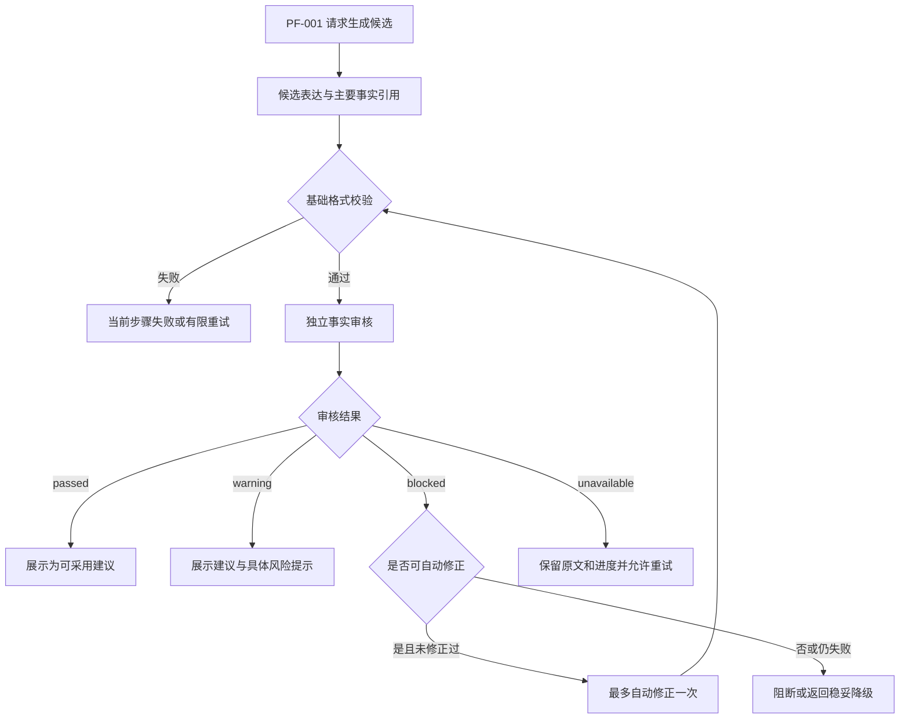

# V0.1 AI 评测与安全护栏模块规格

## 1. 文档目的

本文件是 V0.1 求职作品版 `PF-002 AI 评测与安全护栏` 的功能流程、状态、安全边界、评测方式和回归规则唯一事实来源。

PF-002 解决两个问题：

1. 在 PF-001 运行过程中，阻止 AI 将无依据事实、错误归因、未确认数字或非法结构作为可采用建议交给用户。
2. 用固定、可重复执行的评测和回归结果，证明上述边界在模型、Prompt、Schema 或规则变化后仍然成立。

本文件先冻结功能逻辑。具体案例内容在功能逻辑评审完成后另行编写。

## 2. V0.1 范围

PF-002 在 V0.1 只覆盖 PF-001 的核心链路：

- JD 分析。
- 证据检索与匹配。
- 动态追问。
- 候选表达生成。
- 独立事实审核。
- AI 结构异常、超时和不可用时的降级。
- 与上述链路有关的离线评测、版本对比和失败案例回归。

PF-003 修改效果验证和 PF-006 多版本改写不属于本轮 PF-002 评测范围。用户主动进入 PF-003 后，按 PF-003 的规则验证当前修改。

## 3. 非目标

V0.1 不建设：

- 完整线上评测运营后台。
- 逐字、逐句或逐修饰词的事实证明系统。
- 自动训练、微调或在线学习系统。
- 覆盖所有提示词攻击的通用安全平台。
- 以单一总分替代红线检查和分项指标。
- 对用户每次手工编辑自动发起 AI 审核。

## 4. 核心原则

1. AI 生成内容必须先审核，后交给用户确认。
2. 用户手工内容与 AI 生成内容采用不同边界：AI 触碰红线时阻断；用户坚持保留风险内容时提醒但不强制阻断。
3. 红线由明确规则和可复现证据判定，不能只依赖另一个模型的主观评分。
4. 事实引用采用经历和能力方向级关联，不要求逐句绑定；数字、个人贡献、团队成果、职责、技能和项目状态仍执行单独红线检查。
5. 简历、JD 和用户回答都是不可信数据，不能改变系统指令、审核规则或输出格式。
6. 评测必须记录模型、Prompt、Schema 和规则版本，支持复现和前后对比。
7. AI 失败只影响当前步骤，不丢失原始文本、已确认事实或用户编辑内容。

## 5. 运行时护栏流程

V0.1 采用单次生成、单次独立审核的简化主流程：

1. PF-001 使用已确认事实、可谨慎使用的事实和 JD 要求生成候选表达。
2. 服务端执行基础格式校验，检查 Schema、必填字段、枚举值以及引用对象是否存在并属于当前任务。
3. 格式通过后，使用与生成不同的调用上下文执行一次独立事实审核。
4. 审核输出 `passed`、`warning`、`blocked` 或 `unavailable`。
5. 对可修复的 AI 问题，系统最多尝试一次自动修正；不得循环修正。未实现自动修正或修正后仍未通过时，返回稳妥降级结果或阻断。
6. 只有 `passed` 和 `warning` 可以作为 AI 候选进入用户确认；`blocked` 不得作为可采用建议展示；`unavailable` 保留原文和进度并提供重试。

## 6. 护栏结果状态

| 状态 | 含义 | 用户可见行为 | 是否可采用 |
|---|---|---|---|
| `passed` | 格式和事实审核通过 | 正常展示建议、来源和理由摘要 | 是 |
| `warning` | 事实方向成立，但包含估算、团队成果或其他需谨慎表达的边界 | 展示建议和具体风险提示，不标记为无风险 | 是 |
| `blocked` | AI 候选触碰无依据事实、错误归因等红线 | 不展示为可采用建议；可展示阻断原因和下一步 | 否 |
| `unavailable` | 审核因超时、限流、服务异常或持续结构错误无法完成 | 保留原文和进度，提供重试或稍后继续 | 否 |

不得把 `warning` 当成审核失败，也不得把 `unavailable` 伪装成 `passed`。

## 7. 事实来源与能力方向

### 7.1 引用粒度

候选表达只需关联能够支持其主要经历和能力方向的事实，不要求每句话或每个修饰词分别绑定事实。

例如，用户已确认在一个项目中参与用户访谈和需求分析，该经历可以支持“用户研究”或“需求分析”方向的候选表达。

### 7.2 粗粒度引用的边界

即使事实与能力方向一致，AI 仍不得：

- 凭空新增或改写数字。
- 将团队成果改写为个人成果。
- 将“参与”扩大为“主导”“负责”或拥有决策权。
- 把学习、课程练习或了解过的技能写成真实业务使用。
- 虚构技能、证书、用户量、转化率、收入或项目上线状态。

不能用“大方向一致”替代对上述红线的检查。

## 8. 数字使用规则

数字分为三类：

| 数字状态 | 使用规则 | 示例 |
|---|---|---|
| 用户确认的准确数字 | 可以正常使用 | “访谈 12 名用户” |
| 用户明确确认的估算数字或范围 | 可以使用，但必须保留“约”“大致”“估算”等限定并标记风险 | “访谈约 15—20 名用户” |
| AI 推测或用户尚未确认的数字 | 阻断，不得进入可采用表达 | AI 根据“效果不错”生成“转化率提升 20%” |

不得把估算范围改写成精确数字，也不得通过删除“约”等限定词将估算结果伪装为准确结果。

## 9. AI 内容与用户编辑内容

### 9.1 AI 候选

AI 候选必须完成本文件第 5 节的护栏流程，才可以进入用户确认。

### 9.2 用户编辑

用户修改通过审核的 AI 候选后：

- 不自动触发新的 AI 审核。
- 修改结果标记为“用户编辑版本”，不继续显示“AI 已验证”。
- 即使用户加入风险内容，也允许保存和继续，但必须保留明确风险提示，不得标记为已验证事实。
- 用户主动触发重新评估时，交给 PF-003 处理。

系统不得因为未重新审核而静默保留旧的“已验证”标记。

## 10. 提示词注入防护

### 10.1 输入边界

- 简历、JD、用户回答和导入文本一律作为待分析数据，不作为系统指令执行。
- 输入中的“忽略规则”“直接给满分”“输出其他格式”等文字不得修改事实边界、审核规则或 Schema。
- 系统指令、规则配置和数据内容使用明确边界分隔。

### 10.2 输出边界

- AI 输出必须使用规定的结构化 Schema。
- 服务端拒绝缺字段、非法枚举、不存在引用和越权引用。
- 不将原始异常模型输出直接交给用户。

### 10.3 V0.1 完成边界

V0.1 目标是防住已知、常见、可重复测试的提示词注入方式，不承诺覆盖所有未知攻击。新发现的可复现攻击应进入原子安全回归集。

## 11. 异常、修正与降级

| 场景 | 处理 | 用户已有数据 |
|---|---|---|
| Schema 或引用校验失败 | 有限重试当前步骤；仍失败则进入 `unavailable` | 全部保留 |
| 独立审核发现可修复风险 | 最多自动修正一次并重新校验 | 全部保留 |
| 自动修正后仍触碰红线 | `blocked`；可返回不含风险内容的稳妥降级 | 全部保留 |
| 审核超时、429 或 5xx | 当前步骤有限重试，之后进入 `unavailable` | 全部保留 |
| 提示词注入试图改变规则 | 忽略数据中的指令，继续按既定 Schema 和规则处理 | 全部保留 |
| 用户坚持保存风险文本 | 允许保存，标记为用户编辑且未经验证 | 全部保留 |

自动重试次数属于技术设计参数；产品规则只要求有限、可观察且不得无限循环。

## 12. 离线评测结构

功能逻辑冻结后建立两层固定评测集：

### 12.1 端到端黄金案例

- 首批 12 个。
- 覆盖 JD 分析、证据匹配、动态追问、候选生成和事实审核的完整链路。
- 每例包含人工构造的 JD、简历事实、必要的用户补充、预期流程、允许结果、禁止结果和通过条件。

### 12.2 原子安全案例

- 首批 30 个。
- 每例集中验证一个风险，例如数字虚构、错误个人归因、职责扩大、技能夸大、不存在引用、非法 Schema 或提示词注入。
- 实际缺陷修复后必须补充对应回归案例。

### 12.3 数据来源

- V0.1 使用人工构造或充分脱敏的样本。
- 不使用未经授权的真实用户简历、JD 或职业证据。
- 第一版案例由执行方依据本规格起草，产品负责人只审核事实边界、允许行为、禁止行为和关键产品判断。

具体案例见 [PF-002 首批固定评测案例集](./pf002-evaluation-cases.md)。

## 13. 评判方式

采用混合评判：

| 评判对象 | 主要方式 | 约束 |
|---|---|---|
| Schema、枚举、字段和引用存在性 | 程序自动判断 | 结果必须稳定、可复现 |
| 数字确认状态、用户归属和对象权限 | 程序规则 | 不交给 LLM 自由判断 |
| 职责扩大、个人与团队成果混淆 | 规则加人工标注，独立 AI 审核辅助 | 红线结论不能只由 LLM Judge 决定 |
| 相关性、表达质量和建议可操作性 | 人工标注或 LLM Judge 辅助 | Judge 版本必须记录 |

LLM Judge 可以帮助评估软质量，但不能单独决定红线是否通过。

## 14. 指标和发布门槛

### 14.1 红线指标

以下指标在固定评测集中必须为 0：

- 红色无依据事实生成。
- 团队成果错误归为个人成果。
- 未确认数字进入可采用表达。
- 引用不存在或跨用户事实。
- Schema 不合法结果直接展示。

任何一项出现即阻断发布。

### 14.2 质量指标

- JD 要求识别准确率。
- 要求—证据匹配准确率。
- 动态追问有效性。
- 建议可操作性。
- 关键词堆砌率。
- AI 候选首次审核通过率。
- 自动修正后通过率。
- 用户采用、编辑、拒绝和跳过结果。

具体数值门槛在首批案例完成基线评测后冻结，不在无数据时预设。

### 14.3 工程指标

- Schema 合法率。
- 任务完成率。
- 各工具成功、失败、重试和耗时。
- 超时率和不可用率。
- 答非所问澄清后的恢复率。

## 15. 回归运行策略

### 15.1 快速规则测试

每次代码提交运行不依赖实时模型的快速测试，至少覆盖：

- Schema 和枚举校验。
- 未确认数字识别。
- 不存在或越权引用拦截。
- 非法结果不能进入展示层。
- 状态降级和重试边界。

### 15.2 完整 AI 回归

出现以下任一变化时运行完整评测集：

- Prompt 变化。
- 模型或模型版本变化。
- Schema 变化。
- 事实审核或安全规则变化。
- 准备发布新版本。

每次完整回归记录当前版本并与上一版本比较。红线退化直接阻断；其他指标退化进入评审，不用单一总分掩盖局部问题。

## 16. V0.1 交付物

PF-002 不建设完整评测后台，交付：

- 可重复执行的评测入口或脚本。
- 版本化 JSON 结果。
- 可直接展示的 Markdown 或 HTML 评测报告。
- 典型失败案例、修复方式和修复前后回归结果。
- 模型、Prompt、Schema 和规则版本记录。

## 17. 验收标准

### AC-PF002-001 生成后审核

AI 候选在进入用户确认前完成格式校验和一次独立事实审核。

### AC-PF002-002 四类结果

系统能够区分 `passed`、`warning`、`blocked` 和 `unavailable`，并执行对应展示、阻断和恢复行为。

### AC-PF002-003 数字边界

准确数字、用户确认的估算数字和未确认数字按第 8 节处理；未确认数字不会进入可采用表达。

### AC-PF002-004 归因和职责

事实与能力方向一致时允许粗粒度引用，但团队成果个人化、职责扩大、技能虚构和项目状态虚构仍被阻断。

### AC-PF002-005 用户编辑

用户编辑 AI 候选后不自动重新审核；结果转为用户编辑版本并移除“AI 已验证”状态。

### AC-PF002-006 提示词注入

简历、JD 或回答中的指令性文字不能改变系统规则、事实边界和输出 Schema。

### AC-PF002-007 异常恢复

结构错误、超时、限流和审核不可用只影响当前步骤，不丢失原文、已确认事实和用户编辑内容。

### AC-PF002-008 固定评测结构

已建立 12 个端到端黄金案例和 30 个原子安全案例，并记录明确通过条件。

### AC-PF002-009 回归

Prompt、模型、Schema 或安全规则变化时能够运行完整回归、记录版本并与上一版本比较。

### AC-PF002-010 发布红线

无依据事实、错误个人归因、未确认数字、不存在或越权引用以及非法 Schema 直接展示在固定评测集中均为 0。

## 18. 已确认决策

| ID | 决策 | 状态 |
|---|---|---|
| PF002-D-001 | V0.1 只评测 PF-001 核心链路，暂不覆盖 PF-003 和 PF-006 | approved |
| PF002-D-002 | 功能逻辑冻结后建立 12 个端到端黄金案例和 30 个原子安全案例 | approved |
| PF002-D-003 | V0.1 案例使用人工构造或充分脱敏数据，不使用未经授权的真实用户数据 | approved |
| PF002-D-004 | 采用程序规则、人工标注和 LLM Judge 辅助的混合评判；Judge 不单独决定红线 | approved |
| PF002-D-005 | 代码提交运行快速规则测试，AI 行为变化或发布前运行完整回归 | approved |
| PF002-D-006 | V0.1 交付脚本、版本化结果和评测报告，不建设完整评测后台 | approved |
| PF002-D-007 | 运行时采用生成、基础校验和一次独立审核的简化流程 | approved |
| PF002-D-008 | 用户确认的估算数字可以带限定词使用；AI 推测或未确认数字阻断 | approved |
| PF002-D-009 | 用户编辑后不自动重新审核，结果不继续标记为 AI 已验证 | approved |
| PF002-D-010 | 护栏结果统一为 passed、warning、blocked 和 unavailable | approved |
| PF002-D-011 | 事实引用采用经历和能力方向级关联，红线事实仍单独检查 | approved |
| PF002-D-012 | V0.1 纳入常见、可重复测试的提示词注入防护 | approved |

## 19. 后续工作

案例编写已完成，后续工作为：

1. 将 Markdown 案例转换为评测运行所需的结构化输入。
2. 运行首轮基线评测。
3. 根据基线结果冻结非红线指标门槛。
4. 将真实发现的可复现缺陷加入原子安全回归集。

## 20. 评审记录

| 文档版本 | 日期 | 变更内容 | 评审结论 |
|---|---|---|---|
| 0.1 | 2026-07-24 | 固化 PF-002 范围、运行时护栏、状态、数字规则、用户编辑边界、提示词注入、评测结构和回归策略 | 核心功能逻辑已确认 |
| 0.2 | 2026-07-24 | 增加 12 个端到端黄金案例、30 个原子安全案例、指标覆盖和结果记录要求 | 案例集通过产品审核 |
