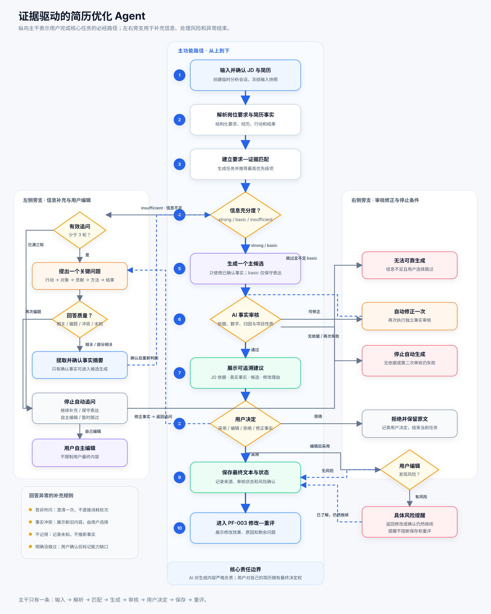
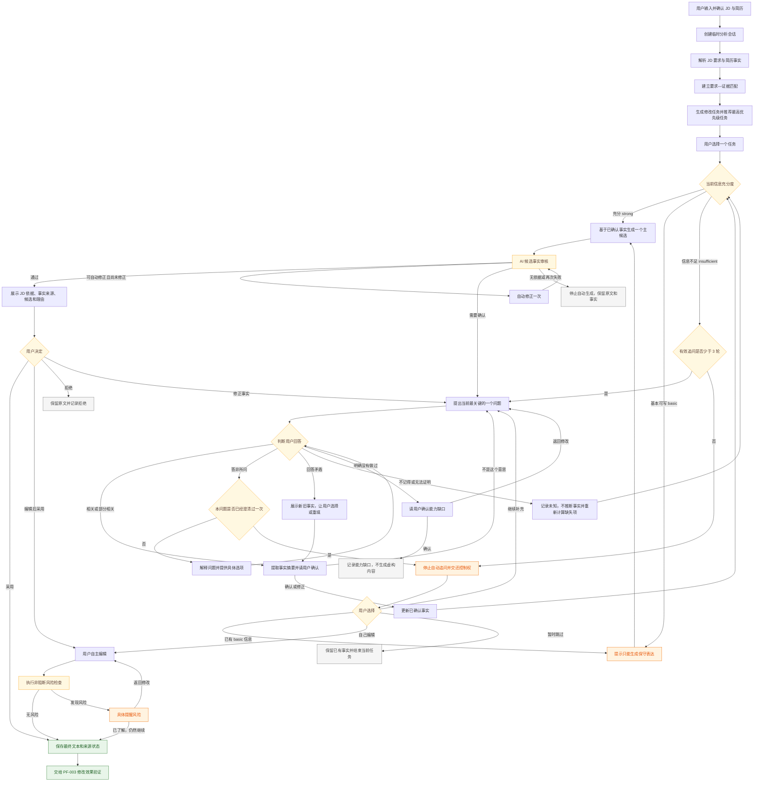

# V0.1 证据驱动的简历优化 Agent 模块规格

## 核心流程图



流程图采用从上到下的单一主干，动态追问、审核修正、用户编辑和停止条件位于左右旁支。默认使用 SVG 展示并可直接导入 Figma 继续编辑；下方 Mermaid 内容作为流程逻辑源码保留。

<details>
<summary>查看 Mermaid 逻辑源码</summary>



</details>

流程图中的“三轮”指三轮有效追问：相关或部分相关的回答计入轮次；答非所问触发一次澄清但不直接消耗轮次。三轮结束不强制生成，用户可以继续补充、采用保守表达、自主编辑或跳过。

## 1. 文档目的

本文件是 V0.1 求职作品版 `PF-001 证据驱动的简历优化 Agent` 的功能、流程、状态和业务规则唯一事实来源。

本文件回答：

1. 用户如何从 JD 和简历进入一个完整的优化任务。
2. Agent 如何解析、匹配、追问、生成、审核和结束任务。
3. 三轮动态追问如何计算，答非所问时如何处理。
4. 什么信息足以生成简历表达，什么情况只能保守表达或停止生成。
5. AI 生成内容和用户手写内容分别接受什么约束。
6. 功能达到什么条件才算 V0.1 可交付。

版本归属以[版本规范与路线图](../00-version-specification-and-roadmap.md)为准。未来产品 MVP 的长期证据库和完整修改工作台不自动进入本模块范围。

## 2. 功能目标

用户提供一份产品岗位 JD 和一份简历后，Agent 分析全文、识别要求与事实、推荐高优先级修改任务，并帮助用户逐项完成一次可信的简历优化。

Agent 不直接执行未经确认的整份简历重写，而是通过以下闭环工作：

```text
理解岗位
→ 查找简历事实
→ 判断证据充分度
→ 必要时动态追问
→ 用户确认事实
→ 生成候选表达
→ 审核 AI 候选
→ 用户采用、编辑或拒绝
→ 交给修改效果验证
```

### 2.1 核心价值

- 可追溯：每条建议关联 JD 原文和用户真实事实。
- 可验证：生成内容在交付前接受事实审核。
- 可控制：新增事实由用户确认，最终内容由用户决定。
- 可解释：展示证据引用和理由摘要，不展示模型私有思维链。
- 可停止：信息不足、用户拒绝或审核持续失败时有明确结束方式。

### 2.2 V0.1 完成尺度

- Agent 分析整份 JD 和整份简历。
- Agent 将结果拆为可独立处理的修改任务。
- 默认推荐一个最高优先级任务。
- 用户可以选择其他任务，完成一项后也可以继续下一项。
- V0.1 验收只要求至少一个任务完整跑通，不要求一次性完成整份简历优化。

## 3. 模块边界

### 3.1 本模块负责

- 接收并确认 JD 和简历输入。
- 建立单次分析会话和任务状态。
- 解析岗位要求和简历事实。
- 建立要求—证据匹配。
- 区分表达缺口、信息缺口和能力缺口。
- 推荐高优先级修改任务。
- 按缺失事实动态追问。
- 提取并让用户确认回答中的事实。
- 基于已确认事实生成一个主候选。
- 对 AI 候选执行强制事实审核。
- 支持用户采用、编辑、拒绝和风险确认。
- 将已完成修改交给 PF-003 修改效果验证。

### 3.2 本模块不负责

- 账号、登录、跨设备同步和长期保存。
- 长期职业证据库和多岗位版本管理。
- 自动重写整份简历。
- 同时生成多个文风版本；该能力属于 PF-006。
- 完整 PDF/Word 排版和导出。
- 自动投递、岗位搜索和完整面试训练。
- 复杂多 Agent 协作。
- 展示或保存模型私有思维链。

## 4. 用户与数据前提

### 4.1 用户前提

- 用户希望针对一条产品岗位 JD 优化现有简历。
- 用户接受系统对 AI 建议进行事实约束。
- 用户对自己手写内容保留最终决定权。

### 4.2 输入

| 输入 | 必填 | V0.1 形式 | 校验 |
|---|---|---|---|
| JD | 是 | 粘贴文本；可复用现有 OCR | 非空、达到最小有效长度 |
| 简历 | 是 | 粘贴文本、PDF、DOCX、TXT | 可提取有效文本 |
| 岗位名称 | 否 | 手动填写或从 JD 提取 | 允许用户修正 |
| 用户回答 | 按需 | 选项或自由文本 | 进入答案质量判断 |

### 4.3 输出

- 岗位核心要求列表。
- 简历事实列表及原文位置。
- 要求—证据匹配结果。
- 表达缺口、信息缺口或能力缺口。
- 一个通过事实审核的 AI 主候选，或无法可靠生成的明确结论。
- 用户最终采用、编辑、拒绝或跳过的结果。
- 可交给 PF-003 的原文、最终文本、证据和风险状态。

## 5. 端到端用户主流程

| 步骤 | 用户行为 | 系统行为 | 结果 |
|---|---|---|---|
| 1 | 进入“新建分析” | 创建临时分析会话 | 获得 `agentSessionId` |
| 2 | 输入 JD 和简历 | 校验并提取文本 | 输入可确认 |
| 3 | 确认解析文本 | 冻结本次分析输入快照 | 允许启动 Agent |
| 4 | 点击“开始分析” | 解析 JD、简历并建立证据匹配 | 生成修改任务 |
| 5 | 查看匹配结果 | 推荐一个最高优先级任务 | 用户选择任务 |
| 6 | 开始优化 | 判断当前任务的证据充分度 | 进入生成、追问或缺口分支 |
| 7 | 回答并确认事实 | 提取事实、更新充分度和下一步 | 获得可用事实 |
| 8 | 查看 AI 候选 | 生成并审核候选 | 候选通过、修正或停止 |
| 9 | 采用、编辑、拒绝或跳过 | 记录用户决定和风险状态 | 任务形成结果 |
| 10 | 完成修改并验证 | 将本轮基线、最终文本和任务最初原文交给 PF-003 | 统一比较 Diff、证据覆盖和安全状态 |

## 6. 页面与交互流程

### 6.1 新建分析

JD 和简历在同一流程中完成，但允许用户先填写任意一项。两项均通过校验后，“开始分析”才可用。

必须提供：

- 原始输入预览。
- 文件解析失败后的重试或粘贴文本入口。
- 用户修正解析文本的能力。
- 输入用途和临时数据说明。

### 6.2 Agent 执行进度

面向用户展示可验证的任务步骤，不展示私有推理内容：

```text
✓ 读取岗位要求
✓ 提取简历事实
✓ 匹配岗位要求与经历
● 识别优先修改项
○ 生成修改建议
○ 检查事实依据
```

用户可以：

- 查看当前步骤。
- 查看已完成步骤和结果摘要。
- 在单步失败时重试。
- 退出并在临时会话仍有效时返回。

### 6.3 证据匹配结果

每个任务卡展示：

- JD 原话。
- 结构化岗位要求。
- 对应简历原文。
- 已找到的事实。
- 当前缺口类型。
- 判断理由摘要。
- 优先级及其理由。
- “开始优化”操作。

默认突出推荐任务，但不强制用户处理该任务。

### 6.4 追问与事实确认

追问采用“一次一个关键问题”的方式。页面同时展示：

- 为什么需要这个信息。
- 当前已确认事实。
- 本轮问题。
- 推荐选项和自由输入框。
- “不记得”“没有做过”“无法证明”。

回答后先展示 Agent 提取的事实摘要，用户可选择：

- 确认。
- 修改。
- “不是这个意思”并重新表达。

未确认的回答不得进入 AI 候选的事实集合。

### 6.5 候选与决定

候选页同时展示：

1. JD 依据。
2. 简历原文。
3. 已确认事实。
4. AI 修改建议。
5. 修改理由摘要。
6. 事实审核结果。

用户可以：

- 采用。
- 编辑后采用。
- 拒绝并保留原文。
- 修正事实后重新生成。
- 返回证据匹配。
- 进入重新评估。

## 7. Agent 工作流与工具

V0.1 使用一个编排 Agent。编排器根据当前状态选择工具，工具之间不直接调用。

| 工具 | 职责 | 主要输入 | 主要输出 |
|---|---|---|---|
| `parseJD` | 提取岗位方向、要求和优先级 | JD 文本 | `JobRequirement[]` |
| `parseResume` | 提取经历、行动、结果和原文位置 | 简历文本 | `ResumeFact[]` |
| `matchEvidence` | 建立要求与事实的对应关系 | 要求、事实 | `EvidenceMatch[]` |
| `classifyGap` | 判断缺口类型和充分度 | 匹配结果 | `gapType`、`sufficiency` |
| `selectNextQuestion` | 选择价值最高的缺失事实 | 当前事实、缺失字段 | 一个问题 |
| `assessAnswer` | 判断回答质量并提取候选事实 | 问题、回答、上下文 | 质量、事实、冲突 |
| `summarizeFact` | 生成供用户确认的事实摘要 | 候选事实 | 待确认事实 |
| `draftRevision` | 基于已确认事实生成一个主候选 | JD、原文、确认事实 | AI 候选 |
| `verifyRevision` | 检查候选的事实和归因风险 | 候选、事实集合 | 审核结果 |
| `reevaluateSection` | 对最终文本进行重新评估 | 原文、最终文本、JD | PF-003 输入 |

### 7.1 编排原则

1. 工具必须返回结构化结果并通过 Schema 校验。
2. `draftRevision` 只能读取已确认事实。
3. `verifyRevision` 与 `draftRevision` 的职责分离。
4. 审核失败最多自动修正一次。
5. 工具失败不清空已经确认的事实和用户文本。
6. 每次状态变化都能说明“发生了什么”和“用户下一步能做什么”。

## 8. 状态模型

### 8.1 会话状态

```text
draft
→ parsing
→ matching
→ evidence_ready
→ task_in_progress
→ ready_for_reevaluation
→ completed
```

终止状态：

```text
cancelled
expired
```

### 8.2 单个优化任务状态

```text
pending
→ assessing_evidence
→ questioning
→ awaiting_fact_confirmation
→ generating
→ verifying
→ awaiting_user_decision
→ accepted / user_edited / rejected / skipped / capability_gap
→ ready_for_reevaluation
```

可恢复异常状态：

```text
parse_failed
match_failed
question_failed
generation_failed
verification_failed
```

### 8.3 状态记录

每次状态变化至少记录：

- 前一状态和当前状态。
- 触发事件。
- 工具名称。
- 输入和输出的非敏感摘要。
- 错误类型。
- 开始时间、结束时间和耗时。

不得记录模型私有思维链、密码、令牌或不必要的完整简历文本。

## 9. 简历事实结构

每条经历事实可包含：

| 字段 | 含义 | 示例 |
|---|---|---|
| `context` | 场景、项目或业务对象 | 校园二手交易平台 |
| `action` | 用户本人采取的行动 | 设计问卷、进行访谈 |
| `method` | 方法、工具或过程 | 用户访谈、竞品分析、Figma |
| `contribution` | 用户个人职责边界 | 负责调研部分、独立完成原型 |
| `result` | 结果、影响或产出 | 形成需求清单、方案进入开发 |
| `quantity` | 已确认数字 | 36 份有效问卷 |
| `attribution` | 个人或团队成果归属 | 四人团队共同完成 |
| `sourceText` | 对应简历或用户原话 | 原始文本片段 |
| `confirmation` | 用户确认状态 | pending/confirmed/rejected |

数字、个人贡献和团队成果归属必须单独确认。

## 10. 信息充分度与生成规则

### 10.1 `strong`：充分，可生成完整表达

至少具备：

- 具体行动。
- 行动对象或问题场景。
- 个人职责边界。
- 方法或结果至少一项明确。

允许生成包含行动、方法和结果的表达，但仍不得添加未确认数字或影响。

### 10.2 `basic`：基本可写，只能保守表达

至少具备：

- 具体行动。
- 行动对象。
- 基本职责边界。

允许生成保守表达，不得补充数字、结果、影响或扩大个人贡献。

### 10.3 `insufficient`：信息不足

只有“参与”“协助”“负责相关工作”等模糊信息，或者无法确认个人行动与职责。

系统不得为了完成流程强行生成完整简历描述，应提供：

- 继续补充。
- 在达到 `basic` 后使用保守表达。
- 用户自主编辑。
- 暂时跳过。

## 11. 动态追问规则

### 11.1 追问目标

每轮只追问当前最影响可写性的一个字段，推荐优先级：

1. 个人具体行动。
2. 行动对象或问题。
3. 个人职责和团队边界。
4. 方法、工具或过程。
5. 结果、产出或影响。
6. 可确认的数字。

具体优先级由当前已有事实动态调整，不使用固定三问模板。

### 11.2 三轮有效追问

- Agent 默认最多主动发起三轮有效追问。
- 一轮只提出一个主要问题。
- `relevant` 和 `partial` 回答消耗一轮。
- `off_topic`、`contradictory` 和系统未正确理解不直接消耗有效轮次。
- 每个主要问题最多允许一次不计轮次的澄清。
- 三轮结束后 Agent 停止自动访谈并把控制权交还用户。
- 用户可以主动选择“继续补充”，此后按一次一个问题继续，不设置强制生成目标。

三轮是默认交互预算，不是“必须在三轮内生成”的承诺。

### 11.3 问题形式

- 优先使用与当前经历相关的具体问题。
- 提供互斥、易理解的推荐选项，同时保留自由输入。
- 允许“不记得”“没有做过”“无法证明”。
- 不暗示用户虚构数字、职责或结果。
- 不重复询问已经确认的事实。

## 12. 回答质量与答非所问处理

`assessAnswer` 必须返回以下分类之一：

| 分类 | 定义 | 是否计入有效轮次 | 下一步 |
|---|---|---:|---|
| `relevant` | 回答直接解决当前问题并产生新事实 | 是 | 提取并确认事实 |
| `partial` | 回答相关但缺少关键部分 | 是 | 确认已有部分，重新计算下一问 |
| `off_topic` | 回答与当前问题无关 | 否 | 澄清一次 |
| `contradictory` | 与已确认事实冲突 | 否 | 展示冲突并让用户选择 |
| `unknown` | 不记得、无法证明或不确定 | 是 | 不推断事实，选择其他缺失字段或停止 |
| `not_done` | 用户明确表示没有做过 | 是 | 允许确认能力缺口 |

### 12.1 一次澄清

用户答非所问时，Agent说明真正需要确认的内容，并提供具体选项。例如：

> 我想确认的是你本人在项目中完成了什么，而不是整个团队做了什么。以下哪项更接近你的情况？

若澄清后仍答非所问，不继续循环，改为提供：

- 查看回答示例。
- 手动填写事实。
- 跳过当前问题。
- 在信息达到 `basic` 时使用保守表达。

### 12.2 冲突处理

新回答与已确认事实冲突时：

1. 同时展示两条表述。
2. 不自动覆盖旧事实。
3. 让用户选择旧事实、新事实或重新填写。
4. 只有用户确认后的版本进入事实集合。

## 13. 事实确认

每轮有效回答后立即展示事实摘要，不等待三轮全部结束。

事实状态：

```text
extracted
→ pending_confirmation
→ confirmed / corrected / rejected
```

用户操作：

- 确认。
- 修改并确认。
- “不是这个意思”。
- 删除本条事实。

只有 `confirmed` 和 `corrected` 事实可以进入 `draftRevision`。

## 14. 缺口分类

| 缺口 | 判定条件 | 系统行为 |
|---|---|---|
| 表达缺口 | 已有足够事实，但简历没有写清 | 生成候选并说明改善点 |
| 信息缺口 | 用户可能做过，但当前信息不足或无法确认 | 追问、保守表达或跳过 |
| 能力缺口 | 用户明确确认没有相关经历或没有做过 | 不生成虚构经历，提供真实应对建议 |

答非所问、不记得、无法证明以及三轮后仍不足，都只能判为信息缺口，不能自动升级为能力缺口。

## 15. AI 候选生成

### 15.1 生成约束

- V0.1 每次只生成一个主候选。
- 所有事实必须来自当前任务的已确认事实集合。
- 不增加未确认的数字、工具、职责、结果或影响。
- 不把团队成果改写成个人成果。
- 不把课程练习、模拟项目或概念方案表述为真实上线业务。
- 信息仅达到 `basic` 时只能生成保守表达。

### 15.2 无法生成

当信息为 `insufficient` 时，Agent返回无法可靠生成的原因和可选动作，不返回用占位词伪装完成的候选。

## 16. AI 候选事实审核

`verifyRevision` 检查：

- 候选中的每项事实是否存在来源。
- 是否出现未确认数字。
- 是否扩大用户个人职责。
- 是否将团队成果归为个人。
- 是否改变项目性质或上线状态。
- 是否遗漏必要的风险说明。

审核结果：

| 结果 | 处理 |
|---|---|
| `passed` | 展示给用户决定 |
| `repairable` | 自动修正一次并再次审核 |
| `needs_confirmation` | 返回对应事实确认 |
| `unsupported` | 丢弃候选并说明无法可靠生成 |
| `system_error` | 保留进度并允许重试 |

自动修正最多一次。第二次仍未通过时停止自动生成，不进入无限循环。

## 17. 用户自主编辑与风险提醒

产品对 AI 生成内容和用户自主内容采用不同责任边界。

### 17.1 AI 生成内容

- 必须通过事实审核后才能作为 AI 建议展示。
- 未通过时不得让用户误以为内容已验证。

### 17.2 用户手写或编辑内容

- 系统执行风险检查并提供具体提醒。
- 风险提醒不得阻止用户保存、进入重评、复制或继续使用。
- 用户可选择返回修改或“我已了解风险，仍然继续”。
- 用户保留的风险内容不得标记为“已验证事实”。

示例提示：

> “负责完整产品设计”没有在当前已确认事实中找到依据。你仍然可以保留，但面试时可能被追问职责范围。

至少记录：

- `contentSource`：`ai_generated` 或 `user_edited`。
- `riskFindings`：发现的风险类型和对应文本。
- `riskAcknowledged`：用户是否确认仍然使用。
- `verificationStatus`：不得把用户确认风险等同于事实审核通过。

## 18. 三轮结束后的处理

三轮有效追问结束后重新计算信息充分度：

| 结果 | 默认动作 |
|---|---|
| `strong` | 生成完整表达并审核 |
| `basic` | 说明限制，生成保守表达并审核 |
| `insufficient` | 不生成，交还控制权 |

交还控制权时提供：

1. 继续补充。
2. 在达到 `basic` 时使用保守表达。
3. 自己编辑并接受风险提醒。
4. 暂时跳过。

## 19. 任务完成与停止条件

满足以下任一条件即可结束当前任务：

- 用户采用了通过审核的 AI 候选。
- 用户编辑后采用，并处理或确认了风险提醒。
- 用户拒绝建议并保留原文。
- 用户明确确认没有相关经历，任务记录为能力缺口。
- 信息不足，用户选择跳过。
- AI 候选连续审核失败，系统停止自动生成并保留原文。
- 用户主动退出，临时会话保留当前状态。

任务完成不等于整份简历完成。用户可以返回任务列表继续下一项。

## 20. 与 PF-003 修改效果验证的交接

进入 PF-003 时传递：

- JD 要求及原文。
- 原始简历文本。
- 最终采用文本。
- 已确认事实。
- 内容来源。
- AI 审核状态。
- 用户风险确认状态。
- 当前缺口类型。

PF-003 只在用户认为本轮完成并点击“完成修改并验证”时运行；编辑和自动保存不触发。不得把“用户选择继续”解释为“事实已经验证”。

## 21. 异常与恢复

| 场景 | 用户提示 | 恢复方式 |
|---|---|---|
| JD 解析失败 | 未能识别有效岗位要求 | 修改文本或重试 |
| 简历解析失败 | 文件未能提取有效文本 | 重新上传或粘贴文本 |
| 匹配失败 | 当前无法完成证据匹配 | 重试，保留输入快照 |
| 追问生成失败 | 暂时无法生成下一个问题 | 用户手动补充或重试 |
| 候选生成失败 | 已确认事实未丢失 | 重试或用户自主编辑 |
| 事实审核失败 | 候选未被标记为可用建议 | 自动修正一次或停止 |
| 页面刷新 | 当前任务未完成 | 根据 `agentSessionId` 恢复临时状态 |
| 临时会话过期 | 本次临时数据已失效 | 重新开始或使用演示模式 |

## 22. 评测与可观察性要求

本模块至少向 PF-002 提供以下可测数据：

- 工具 Schema 合法率。
- 每个工具的成功、失败、重试和耗时。
- 回答质量分类准确性。
- 三轮内达到 `strong`、`basic` 和 `insufficient` 的比例。
- 答非所问澄清后的恢复率。
- 无依据事实和错误归因命中情况。
- AI 候选首次审核通过率。
- 自动修正后通过率。
- 用户采用、编辑、拒绝和跳过结果。

这些数据用于作品评测，不要求在 V0.1 建设完整运营埋点后台。

## 23. 验收标准

### AC-PF001-001 全文分析、逐项优化

给定一份有效 JD 和简历，系统能分析全文、生成多个任务并推荐一个高优先级任务；用户可以选择其他任务。

### AC-PF001-002 动态追问

Agent 根据当前缺失事实逐轮选择问题，不使用固定三问模板；每轮只问一个主要问题。

### AC-PF001-003 有效轮次

`relevant` 和 `partial` 消耗有效轮次；答非所问触发一次澄清但不直接消耗轮次；三轮后不强制生成。

### AC-PF001-004 答非所问

用户连续两次没有回答当前问题时，系统停止循环并提供示例、手工填写、保守表达或跳过。

### AC-PF001-005 事实确认

用户回答产生的事实必须逐轮确认；未经确认的事实不会进入 AI 候选。

### AC-PF001-006 信息充分度

系统能够区分 `strong`、`basic` 和 `insufficient`，分别生成完整表达、保守表达或停止生成。

### AC-PF001-007 缺口分类

系统不会把答非所问、不记得或信息不足自动判断为能力缺口；只有用户明确确认没有做过时才进入能力缺口。

### AC-PF001-008 AI 事实审核

含无依据事实、未确认数字或错误归因的 AI 候选不会作为通过审核的建议展示；自动修正最多一次。

### AC-PF001-009 用户最终决定权

用户手写内容存在风险时，系统给出具体提醒但不阻止保存、重评和继续使用；风险内容不会被标记为已验证。

### AC-PF001-010 状态恢复

任一工具失败后，用户已确认事实和手写内容不会丢失，用户可从失败步骤重试或退出。

### AC-PF001-011 重评交接

用户完成任务后，PF-003 能获得原文、最终文本、事实来源、审核状态和风险确认状态。

## 24. 已确认决策

| ID | 决策 | 状态 |
|---|---|---|
| PF001-D-001 | 全文分析、逐项优化；V0.1 至少完整跑通一个高优先级任务 | approved |
| PF001-D-002 | 每个任务默认最多三轮有效追问，每轮一个主要问题 | approved |
| PF001-D-003 | 答非所问允许一次不计轮次的澄清，仍无效则停止循环并交还控制权 | approved |
| PF001-D-004 | 三轮后不强制生成；用户可主动继续补充 | approved |
| PF001-D-005 | 信息不足与能力缺口严格区分 | approved |
| PF001-D-006 | AI 候选执行强制事实审核，自动修正最多一次 | approved |
| PF001-D-007 | 用户内容只提醒、不阻断，最终决定权属于用户 | approved |

## 25. 评审记录

| 文档版本 | 日期 | 变更内容 | 评审结论 |
|---|---|---|---|
| 0.1 | 2026-07-23 | 建立 PF-001 完整功能流程、Agent 编排、追问和事实边界 | 待产品评审 |
| 0.2 | 2026-07-23 | 在文档开头增加完整主流程图 | 待产品评审 |
| 0.3 | 2026-07-23 | 增加可直接展示和导入 Figma 的 SVG 图形化流程图，折叠 Mermaid 逻辑源码 | 待产品评审 |
| 0.4 | 2026-07-23 | 增加 PNG 展示版本，SVG 继续作为 Figma 可编辑源文件 | 待产品评审 |
| 0.5 | 2026-07-23 | 将图形重排为纵向单一主干，动态追问、审核修正、用户编辑和停止条件作为左右旁支 | 待产品评审 |
| 0.6 | 2026-07-24 | 将 PF-001 交接目标从重新评分更新为用户主动触发的 PF-003 修改效果验证 | 核心定义已确认 |
| 0.7 | 2026-07-24 | 将 PF-003 交接更新为完成一轮修改后统一验证，并传递本轮基线和任务最初原文 | 核心功能逻辑已确认 |
