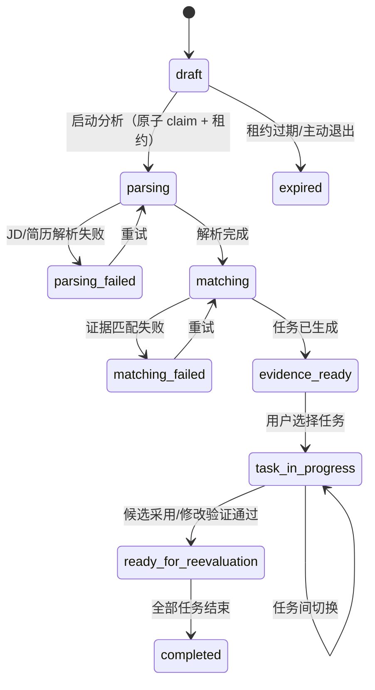
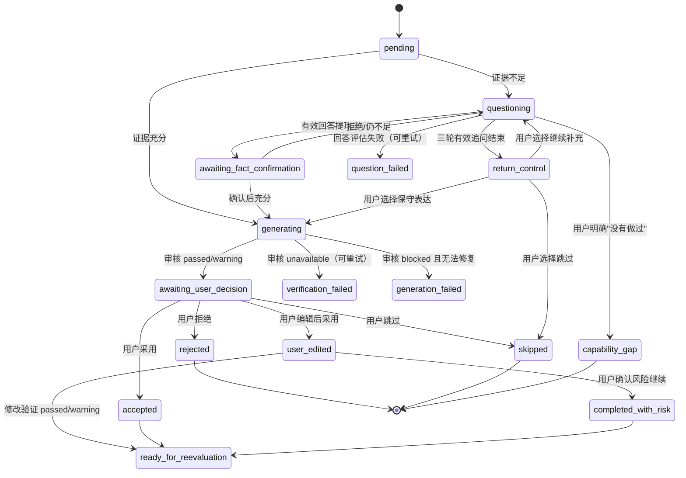

# V0.1 证据驱动简历优化 Agent — 六要素图

> 本文呈现已实现版本（对应 `server/services/agent/agentOrchestrator.js`）的 Agent 六要素：**目标、状态、工具、分支、审核、停止条件**。业务规则以 [模块规格](./modules/portfolio-resume-agent.md) 为唯一事实来源，本图用于交付与面试讲解时的结构速览。

## 1. 目标

把"JD 要求 + 用户真实经历"变成**可追溯、可审核、可停止**的一条简历表达，而不是让 AI 凭空重写。

```text
理解岗位要求 → 提取并确认用户事实 → 判断证据充分度
→ 不足则逐轮追问 → 生成候选 → 强制事实审核 → 用户采用/编辑/拒绝
→ 修改效果验证（PF-003）→ 形成带证据来源的最终文本
```

三个不可退让的边界：

1. **可追溯**：每条建议关联 JD 原话与用户已确认事实。
2. **可审核**：AI 候选在展示前必须通过确定性规则 + 独立语义审核。
3. **可停止**：信息不足、用户拒绝或审核持续失败时有明确结束方式，不无限循环。

## 2. 状态

### 2.1 会话状态



### 2.2 任务状态



## 3. 工具

编排器根据当前状态选择工具，工具之间不直接调用；工具失败不丢失已确认事实。

| 工具 | 职责 | 失败处理 |
|---|---|---|
| `parseJD` | 提取岗位方向、要求和优先级 | 会话进入 `parsing_failed`，保留输入快照 |
| `parseResume` | 提取经历、行动、结果和原文位置 | 同上 |
| `matchEvidence` | 建立要求—事实对应，生成优先级任务 | 会话进入 `matching_failed` |
| `assessAnswer` | 判断回答质量（relevant/partial/off_topic/contradictory/unknown/not_done）并提取事实补丁 | 任务进入 `question_failed`，保留原回答可重试 |
| `draftRevision` | 基于**已确认事实**生成一个主候选 | 返回空候选，进入审核降级 |
| `verifyRevision` | 对候选执行确定性 + 独立语义审核 | 返回 `unavailable`，不默认通过 |
| `repairRevision` | 对 blocked 候选自动修正**最多一次** | 修正失败按 `unavailable` 处理 |
| `evaluateModification` | PF-003 修改效果验证：Diff、证据覆盖、安全状态 | 保留文本与旧记录，不虚构改善 |

## 4. 分支

| 分支点 | 判断依据 | 走向 |
|---|---|---|
| 证据充分度 | 已确认事实合并后 `calculateSufficiency` | `strong` → 完整生成；`basic` → 保守表达；`insufficient` → 追问 |
| 回答质量 | `assessAnswer` 分类 | `relevant/partial` 消耗有效轮次；`off_topic` 澄清一次；`unknown` 不推断事实；`not_done` 判能力缺口 |
| 追问预算 | `effectiveRounds` 累计 | ≥3 轮有效追问 → `return_control`，交还控制权 |
| 事实确认 | 用户对提取摘要的选择 | 确认/修正 → 进入事实集合；拒绝 → 继续追问 |
| 候选审核 | `verifyRevision` 结果 | `passed/warning` → 交用户决定；`unavailable` → 重试审核；`blocked` → 修复一次后仍失败则停止 |
| 用户决定 | 采用/编辑/拒绝/跳过 | `accepted/user_edited` 进入 handoff；其余结束或跳过 |

## 5. 审核

三层审核，任何一层不可用都降级为 `unavailable`，绝不默认通过：

1. **确定性 guardrails**（`domain/agent/guardrails.js`）：数字红线（数值+单位+语义用途）、职责红线（参与/团队 → 主导/负责）、项目状态/证书/技能/学习经验扩大、事实引用有效性。
2. **独立语义审核**（`pf002Evaluator` + 独立提示词）：候选与引用事实最低语义重叠，阻断"完全无关"的内容混入。
3. **修改效果验证**（PF-003，`modificationValidator`）：`changeOutcome`（改善/持平/回退）与 `safetyStatus`（事实安全）独立计算，每次验证追加不可变记录。

用户编辑内容标记为 `unverified_user_content`，只提醒不阻断；风险内容必须用户显式确认才能进入 `completed_with_risk`。

## 6. 停止条件

| 条件 | 结果 |
|---|---|
| 用户采用通过审核的 AI 候选 | 任务 `accepted`，进入 PF-003 |
| 用户编辑后采用（处理或确认风险提醒） | 任务 `user_edited` |
| 用户拒绝建议并保留原文 | 任务 `rejected` |
| 用户明确"没有做过" | 任务 `capability_gap`，不生成虚构经历 |
| 三轮有效追问结束且信息仍不足 | `return_control`，交还控制权 |
| AI 候选连续审核失败（含修复后） | 停止自动生成，保留原文与事实 |
| 用户选择跳过 | 任务 `skipped` |
| 用户确认保留风险内容 | 任务 `completed_with_risk`，handoff 保留 `verificationStatus=blocked` |
| 会话租约过期或用户退出 | 会话 `expired`，保留当前状态可恢复 |

> 流程图参考：模块规格中的 [PF-001 流程图 SVG](./assets/pf001-resume-agent-flow.svg)。
